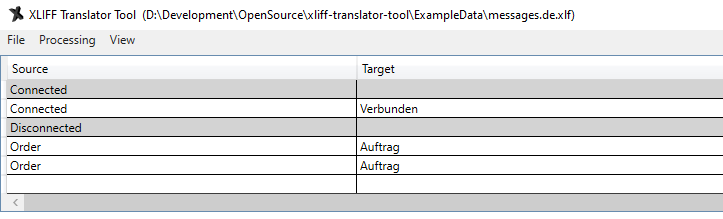
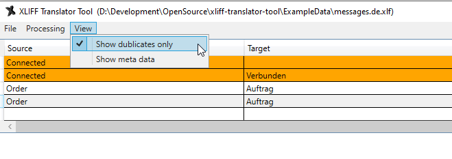

# XLIFF Translator Tool
Simple XLIFF (\*.xlf/\*.xliff 1.2 & 2.0) editor with merge/import feature

I made this tool mainly for *Angular* translations because I couldn't find any simple, suitable and free tool. It's compatible with XLIFF 1.2 and XLIFF 2.0 and you can even combine them (open 1.2, import 2.0).

With this tool you can simply manage and update your translation files. Open old translations file, import newly generated file. 

It's recommended to use "Save As..." option instead of "Save" because your original file won't be touched and you can revert your changes if something went wrong. Also, only with "Save As..." you can choose custom filename and choose from output XLIFF format version (1.2 or 2.0).

Keeps: Unit context information such as purpose, datatype, sourcefile, linenumber

DOWNLOAD: [Releases](https://github.com/DavidOndrus/xliff-translator-tool/releases)

## Images

Table view. Empty target rows marked (gray)


Dublicates only view. Dublicates which differs in target marked (orange).

## Output
SOURCE:
```XML
<?xml version="1.0" encoding="UTF-8" ?>
<xliff version="1.2" xmlns="urn:oasis:names:tc:xliff:document:1.2">
  <file source-language="en" datatype="plaintext" original="ng2.template">
    <body>
      <trans-unit id="loginHeaderTitle" datatype="html">
        <source>Login</source>
        <target>Login</target>
        <context-group purpose="location">
          <context context-type="sourcefile">app/login/login.component.ts</context>
          <context context-type="linenumber">7</context>
        </context-group>
        <note priority="1" from="description">description</note>
        <note priority="1" from="meaning">meaning</note>
      </trans-unit>
    </body>
  </file>
</xliff>
```
RESULT:
```XML
<?xml version="1.0" encoding="UTF-8"?>
<xliff version="1.2" xmlns="urn:oasis:names:tc:xliff:document:1.2">
  <file source-language="en">
    <body>
      <trans-unit id="loginHeaderTitle" datatype="html">
        <source>Login</source>
        <target>Login</target>
		<context-group purpose="location">
          <context context-type="sourcefile">app/login/login.component.ts</context>
          <context context-type="linenumber">7</context>
        </context-group>
        <note from="description">description</note>
        <note from="meaning">meaning</note>
      </trans-unit>
    </body>
  </file>
</xliff>
```

### Angular i18n
Generate XLIFF file with Angular xi18n and open it with this tool
```
ng xi18n --i18nFormat=xlf --outputPath src/locales --outFile strings.en.xlf --locale en
```
or
```
ng xi18n --i18nFormat=xlf2 --outputPath src/locales --outFile strings.en.xlf --locale en
```
